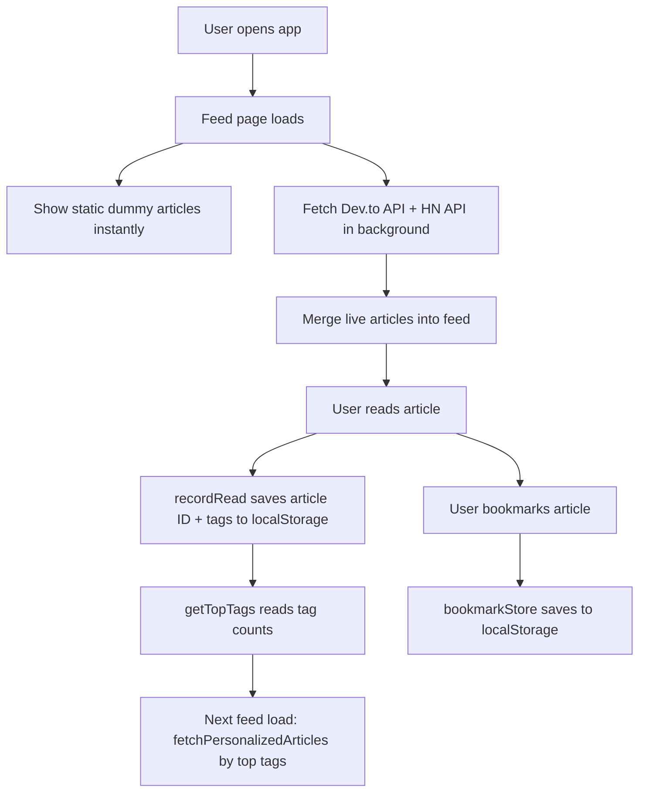

# 🖋️ Inkwell

> **Read What Matters. Every Single Day.**  
> A free, open-source, personalized article reader — your private alternative to Medium.

[](https://opensource.org/licenses/MIT)
[](https://github.com/vaibhavidhenge23/Ink-well/stargazers)
[](https://github.com/vaibhavidhenge23/Ink-well/issues)
[](https://github.com/vaibhavidhenge23/Ink-well/pulls)
[](https://github.com/vaibhavidhenge23/Ink-well/commits/main)
[](https://github.com/vaibhavidhenge23/Ink-well)

---

## 📖 Overview

**Inkwell** is a fully client-side, personalized article reading web app built with React. It aggregates live articles from **Dev.to** and **Hacker News** — two free, open APIs — and presents them in a beautiful, distraction-free reading environment with no paywalls, no ads, and no subscriptions.

The problem it solves: platforms like Medium gate quality content behind paywalls. Inkwell gives you a polished, Medium-like reading experience for free, with real-time personalization that learns your interests from your reading behavior and stores everything locally in your browser.

There is no backend, no database, no authentication server. Everything — reading history, bookmarks, theme preferences, user profile — is stored in `localStorage`. The app is 100% static and can be deployed anywhere for free.

---

## ✨ Features

- 🔴 **Live article feed** — pulls real articles from Dev.to API and Hacker News in real time
- 🧠 **Interest-based personalization** — tracks which topics you read and surfaces more of the same
- 🔍 **Working search** — instant local search + live Dev.to tag search with debounce
- 🗂️ **Category browsing** — Technology, AI, Science, Business, Health, Design, Finance, Philosophy
- 📖 **Distraction-free reader** — clean article view with reading progress bar
- 🎨 **13 reading themes** — Light (Paper, Sepia, Cream, Contrast), Dark (Midnight, Charcoal, Night, Nord, Ocean), Focus (Focus, Forest, Amber, Rosé)
- 🔠 **Adjustable font size** — 14px to 24px, persisted across sessions
- 🔖 **Bookmarks** — save and revisit articles, stored in `localStorage`
- 📊 **Reading stats** — articles read, minutes, streak, favorite topic
- 🏅 **Badge system** — earn badges based on real reading activity
- ♾️ **Infinite scroll** — auto-loads more articles as you scroll
- 👤 **Editable profile** — name, avatar, interests derived from reading history
- ⚙️ **Settings page** — theme, font, notifications, language, clear data
- 📱 **Fully responsive** — desktop 3-column layout, mobile bottom nav

---

## 🛠️ Tech Stack

| Category | Technology |
|---|---|
| **Framework** | React 18 |
| **Build Tool** | Vite 5 (SWC) |
| **Styling** | Tailwind CSS 3 |
| **Component Library** | shadcn/ui (Radix UI primitives) |
| **Routing** | React Router v6 |
| **Animations** | Framer Motion |
| **Data Fetching** | Native `fetch` API (no external client) |
| **State Management** | React `useState` / `useContext` |
| **Persistence** | Browser `localStorage` + `sessionStorage` |
| **Icons** | Lucide React |
| **Testing** | Vitest + Testing Library |
| **Linting** | ESLint 9 |
| **Language** | JavaScript (JSX) |

### External APIs (free, no key required)

| API | Usage |
|---|---|
| [Dev.to API](https://developers.forem.com/api) | Article feed, tag search, personalization |
| [Hacker News Firebase API](https://github.com/HackerNews/API) | Top stories feed |
| [DiceBear Avatars](https://www.dicebear.com/) | Generated user avatars |
| [Unsplash](https://unsplash.com/) | Fallback article cover images |

---

## 🏗️ Architecture

Inkwell is a **fully static single-page application**. There is no server, no database, and no backend of any kind.

```
Browser
  └── React SPA (Vite)
        ├── Pages (React Router)
        │     ├── Landing → Login → Onboarding → Feed
        │     ├── Feed (live articles + infinite scroll)
        │     ├── ArticleRead (reader view + themes)
        │     ├── Explore (search + category browse)
        │     ├── Bookmarks (localStorage)
        │     ├── Profile (stats + badges)
        │     └── Settings (theme, font, data)
        ├── External APIs (Dev.to, Hacker News)
        │     └── 5-min sessionStorage cache
        └── localStorage
              ├── Reading history & tag counts
              ├── Bookmarks
              ├── Reader theme & font size
              └── User profile (name, email)
```

### Data Flow



---

## 📁 Project Structure

```
Ink-well/
├── index.html                  # App entry point, Google Fonts loaded here
├── vite.config.js              # Vite config, @ alias → src/
├── tailwind.config.js          # Custom colors, fonts, category CSS vars
├── src/
│   ├── main.jsx                # React root mount
│   ├── App.jsx                 # Router + global providers
│   ├── index.css               # CSS variables, Tailwind base, custom classes
│   │
│   ├── pages/
│   │   ├── Landing.jsx         # Marketing landing page
│   │   ├── Login.jsx           # Auth UI (client-side only, saves to localStorage)
│   │   ├── Onboarding.jsx      # Interest selection on signup
│   │   ├── Feed.jsx            # Main article feed with infinite scroll
│   │   ├── ArticleRead.jsx     # Full reader view with themes + progress bar
│   │   ├── Explore.jsx         # Search + category browse
│   │   ├── Bookmarks.jsx       # Saved articles from localStorage
│   │   ├── Profile.jsx         # User stats, badges, interests
│   │   ├── SettingsPage.jsx    # Theme, font, notifications, data management
│   │   └── Notifications.jsx   # Notification list
│   │
│   ├── components/
│   │   ├── ArticleCard.jsx     # FeaturedCard, ArticleCard, ArticleCardSmall
│   │   ├── CategoryTag.jsx     # Colored category pill
│   │   ├── NavLink.jsx         # Navigation link component
│   │   └── layout/
│   │       ├── Navbar.jsx      # Top navigation bar
│   │       └── BottomNav.jsx   # Mobile bottom tab bar
│   │
│   ├── contexts/
│   │   └── ReaderThemeContext.jsx   # 13 reading themes, font size, localStorage persist
│   │
│   ├── lib/
│   │   ├── api.jsx             # Dev.to + HN fetch functions with caching & timeouts
│   │   ├── articleStore.jsx    # In-memory store for live-fetched articles
│   │   ├── bookmarkStore.js    # localStorage CRUD for bookmarks
│   │   ├── readingHistory.jsx  # localStorage reading history + tag frequency
│   │   └── utils.jsx           # Tailwind class merge utility (clsx + twMerge)
│   │
│   ├── data/
│   │   ├── articles.jsx        # Static fallback articles, trending topics, feed categories
│   │   ├── interests.jsx       # Onboarding interest categories
│   │   └── types.js            # Category color map constants
│   │
│   └── hooks/
│       ├── use-mobile.jsx      # Responsive breakpoint hook
│       └── use-toast.jsx       # Toast notification hook
```

---

## 🚀 Installation

### Prerequisites

- [Node.js](https://nodejs.org/) v18 or higher
- npm v9 or higher

### Steps

```bash
# 1. Clone the repository
git clone https://github.com/vaibhavidhenge23/Ink-well.git

# 2. Enter the project directory
cd Ink-well

# 3. Install dependencies
npm install

# 4. Start the development server
npm run dev
```

Open [http://localhost:5173](http://localhost:5173) in your browser.

---

## 🖥️ Usage

```bash
# Development server with hot reload
npm run dev

# Production build (outputs to dist/)
npm run build

# Preview the production build locally
npm run preview

# Run tests
npm run test

# Lint the codebase
npm run lint
```

---

## ⚙️ Configuration

Inkwell requires **no environment variables**. All external APIs used are public and free with no API keys required.

### Customisation

| File | What to change |
|---|---|
| `src/index.css` | Global color palette (CSS HSL variables) |
| `src/contexts/ReaderThemeContext.jsx` | Add or modify reading themes |
| `src/data/articles.jsx` | Edit static fallback articles and trending topics |
| `tailwind.config.js` | Category colors, fonts, border radius |
| `index.html` | App title, meta tags, Google Fonts |

---

## 📦 Key Modules

### `src/lib/api.jsx`
Handles all external data fetching.

| Function | Description |
|---|---|
| `fetchDevToArticles(tag, page, perPage)` | Fetches articles from Dev.to API. Uses sessionStorage cache (5 min TTL) and 8s timeout. |
| `fetchHackerNewsArticles(count)` | Fetches top HN stories. Uses `Promise.allSettled` to skip slow individual story requests. |
| `fetchPersonalizedArticles(readTags, count)` | Fetches Dev.to articles by the user's top-read tags. |

### `src/lib/readingHistory.jsx`
Tracks reading behavior in `localStorage`.

| Function | Description |
|---|---|
| `recordRead(articleId, tags)` | Saves article ID + increments tag frequency counters. |
| `getTopTags(n)` | Returns top N most-read tags for personalization. |
| `getReadArticleIds()` | Returns a `Set` of all read article IDs (used to push read articles to bottom of feed). |

### `src/lib/bookmarkStore.js`
Full CRUD for bookmarked articles in `localStorage`.

| Function | Description |
|---|---|
| `addBookmark(article)` | Saves article object to bookmarks list. |
| `removeBookmark(id)` | Removes article by ID. |
| `isBookmarked(id)` | Returns boolean. |
| `getBookmarks()` | Returns full bookmarks array. |

### `src/contexts/ReaderThemeContext.jsx`
Provides reading theme and font size globally, persisted to `localStorage`.

**Available themes:** Paper, Sepia, Cream, Contrast, Midnight, Charcoal, Night, Nord, Ocean, Focus, Forest, Amber, Rosé

---

## 📸 Demo

> _Replace the placeholders below with actual screenshots_

| Feed | Article Reader | Explore |
|---|---|---|
|  |  |  |

| Settings | Profile | Themes |
|---|---|---|
|  |  |  |

---

## 🤝 Contributing

Contributions are welcome! Here's how to get started:

```bash
# Fork the repo and clone your fork
git clone https://github.com/YOUR_USERNAME/Ink-well.git
cd Ink-well
npm install

# Create a feature branch
git checkout -b feature/your-feature-name

# Make your changes, then commit
git add .
git commit -m "feat: describe your change"

# Push and open a Pull Request
git push origin feature/your-feature-name
```

### Guidelines

- Keep PRs focused — one feature or fix per PR
- Follow the existing code style (ESLint config is provided)
- Add or update comments for any new `lib/` utility functions
- Test your changes in both desktop and mobile viewport sizes

---

## 🗺️ Roadmap

- [ ] **PWA support** — installable app with offline reading via service worker
- [ ] **RSS feed support** — add any RSS/Atom feed as a custom source
- [ ] **Article import** — paste a URL to scrape and read any article in-app
- [ ] **Export bookmarks** — download saved articles as JSON or Markdown
- [ ] **Dark/light mode toggle** — system preference auto-detection
- [ ] **Reading goals** — daily article targets with streak tracking
- [ ] **Tag filtering** — exclude specific tags from the feed
- [ ] **Share as card** — generate a shareable image card for any article
- [ ] **Multiple profiles** — support for multiple localStorage profiles

---

## 📄 License

This project is licensed under the **MIT License** — see the [LICENSE](LICENSE) file for details.

```
MIT License

Copyright (c) 2025 vaibhavidhenge23

Permission is hereby granted, free of charge, to any person obtaining a copy
of this software and associated documentation files (the "Software"), to deal
in the Software without restriction, including without limitation the rights
to use, copy, modify, merge, publish, distribute, sublicense, and/or sell
copies of the Software...
```

---

<div align="center">
  Made with ☕ and a love for reading · <a href="https://github.com/vaibhavidhenge23/Ink-well">Inkwell</a>
</div>
